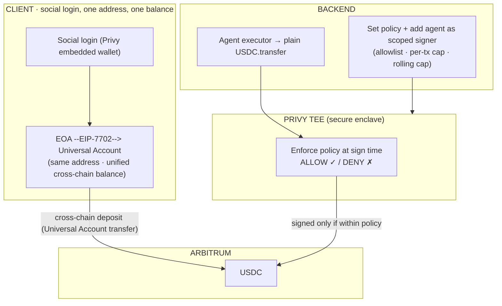

# SupWallet ⚡ Universal Agent Wallet

> One social login turns your EOA into a **Universal Account** (EIP‑7702 — same address, one balance across every chain). Then your AI agent **“Sup”** pays autonomously within a **policy enforced in a TEE** — no seed phrase, no new address, **no smart contract to deploy**, no signing every payment.

**Built for:** Particle Network **Universal Accounts Track (EIP‑7702)** · Arbitrum **“Road to Open House London.”**

> ℹ️ This is the project's **public showcase**. The product's frontend, agent logic, and infrastructure are kept in a private repo — this repo is the architecture, the design decisions, and the on‑chain proof.

---

## 🔗 Demo & on‑chain proof

| | |
|---|---|
| 🎥 Demo video | _<!-- TODO: link -->_ |
| 🌐 Live demo | _<!-- TODO: link -->_ |
| 🔗 Cross‑chain UA funding tx | _<!-- TODO: Arbiscan link -->_ |
| 🔗 Agent policy‑bounded payment tx | _<!-- TODO: Arbiscan link -->_ |
| 🔗 “Blocked by policy” event | _<!-- TODO: Arbiscan / screenshot -->_ |

---

## The problem

Letting an AI agent hold or move your crypto usually means one of two bad trades:

- **Give it your keys** → it can drain you.
- **Fund a separate “agent account”** → you now babysit balances, top‑ups, and a new address, on every chain.

And before any of that, the user has to understand seed phrases, gas, bridging, and which chain their money is on.

## What SupWallet does

**Your wallet stays yours. The agent only gets a bounded allowance to spend it — enforced, not trusted.**

1. **Social login → Universal Account.** Sign in with email/Google (Privy embedded wallet). Your EOA is upgraded **in place via EIP‑7702** into a Particle **Universal Account**: *same address*, one unified balance, usable on any chain.
2. **Fund from anywhere.** Bring USDC from any chain into your account with a single **cross‑chain Universal Account transfer** — no bridging UI, no chain‑picking.
3. **Give Sup an allowance.** The agent is added as a **scoped signer** on *your* wallet with an on‑chain‑style policy: recipient allowlist, per‑transaction cap, rolling spend cap. Setting it is an in‑app action — no gas, no on‑chain transaction.
4. **Sup pays autonomously.** The agent signs payments **within the policy, 0 user signatures**. Every request is checked inside Privy’s **secure enclave (TEE)** before it can be signed — an over‑limit or off‑allowlist payment is **rejected before it ever touches the chain**.
5. **Revoke instantly.** Remove the signer — off‑chain, no gas, effective immediately. Funds never left your wallet, so there is nothing to “withdraw back.”

No seed phrase. No new address. No smart contract to deploy. No thinking about gas or which chain your money is on.

---

## How it works

**Two paths, by design:**
- **Cross‑chain** (bringing value in, or a universal payment) → Particle’s Universal Account flow, which sources liquidity across chains.
- **Autonomous agent spend** → a plain transfer on Arbitrum, signed by the agent’s scoped signer and gated by the TEE policy — fast, gasless (sponsored), and safe.

See **[docs/ARCHITECTURE.md](docs/ARCHITECTURE.md)** for the full design, flows, and trust model.

---

## Universal Accounts + EIP‑7702 — track requirements

| Hard requirement | How SupWallet meets it |
|---|---|
| **Uses EIP‑7702 mode** | The user’s embedded EOA is upgraded in place to a Particle Universal Account (`smartAccountOptions.useEIP7702`), same address — no new account, no contract deployed. |
| **≥ 1 cross‑chain value transfer via UA** | “Fund / top up” pulls USDC from another chain into the Arbitrum account via a Universal Account transfer. |
| **Runnable demo** | Hosted live app + walkthrough video (links above). |

---

## Why **no** smart contract?

Because the account abstraction *is* the account — that’s the whole point of Universal Accounts + 7702. The user’s own address is the wallet **and** the agent’s bounded spending surface. The spending policy (allowlist, caps) is enforced in Privy’s **TEE at signing time**, so there’s nothing to deploy, audit, or migrate. Fewer moving parts, instant policy changes, and the user keeps self‑custody the entire time.

_(We also prototyped a fully trustless on‑chain variant — an `AllowanceRouter` allowance contract — and kept it as a reference for a future “trustless mode.” v1 ships the contract‑less 7702 + TEE approach because it’s simpler and matches the Universal Accounts model.)_

---

## Trust & security model

- **Self‑custody, always.** The agent never holds your principal — it’s a *scoped signer* on your own wallet. Your funds never move to an agent account.
- **Policy is enforced, not trusted.** Every agent payment is validated in Privy’s secure enclave before signing; off‑allowlist or over‑cap payments are rejected pre‑broadcast.
- **Root ≠ agent.** The agent signs with a *scoped authorization key* bound by policy. The app’s root secret is never used to move user funds.
- **Instant revocation.** Remove the signer to cut the agent off immediately — off‑chain, no gas.

---

## Tech stack

- **Auth + agent signer:** Privy embedded wallets · authorization‑key signers · TEE policy engine
- **Chain‑abstraction account:** Particle Network **Universal Accounts** SDK · **EIP‑7702** mode
- **Chain:** Arbitrum One · USDC · gas sponsorship
- **App:** Next.js · TypeScript · viem

---

## Roadmap

- [ ] Public live demo + walkthrough video
- [ ] Multi‑asset allowances (beyond USDC)
- [ ] Recurring/subscription intents
- [ ] Optional trustless on‑chain mode (`AllowanceRouter`)
- [ ] Telegram Mini App distribution

---

## Team

SupWallet — _<!-- TODO: team / contact -->_

Public showcase repo. Product source is private by design.
