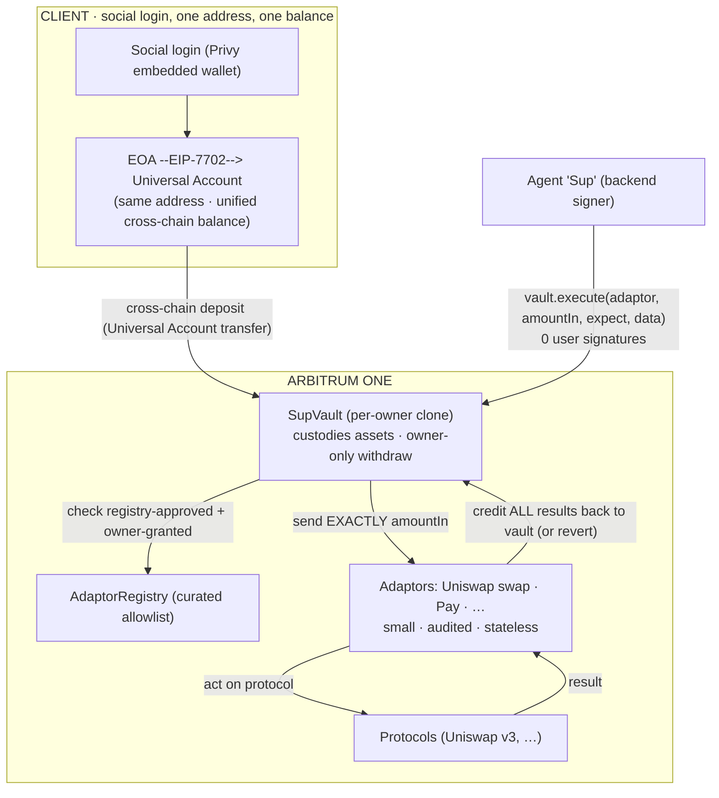

# SupWallet ⚡ Universal Agent Wallet

> One social login turns your EOA into a **Universal Account** (EIP‑7702 — same address, one balance across every chain). Fund it from anywhere, then let your AI agent **“Sup”** run DeFi for you — bounded by an **on‑chain vault** it can operate but never drain.

**Built for:** Particle Network **Universal Accounts Track (EIP‑7702)** · Arbitrum **“Road to Open House London.”**

> ℹ️ This is the project's **public showcase**. The product's frontend, agent logic, and infrastructure are kept in a private repo — this repo is the architecture, the design decisions, and the on‑chain proof.

---

## 🔗 Demo & on‑chain proof

| | |
|---|---|
| 🎥 Demo video | _<!-- TODO: link -->_ |
| 🌐 Live demo | _<!-- TODO: link -->_ |
| 🔗 Cross‑chain UA funding tx | _<!-- TODO: Arbiscan link -->_ |
| 🔗 Agent vault action (swap via adaptor) | _<!-- TODO: Arbiscan link -->_ |
| 📜 Deployed contracts | [see below](#-deployed-on-arbitrum-one) |

---

## The problem

Letting an AI agent hold or move your crypto usually means one of two bad trades:

- **Give it your keys** → it can drain you.
- **Fund a separate “agent account”** → you now babysit balances, top‑ups, and a new address, on every chain.

And before any of that, the user has to understand seed phrases, gas, bridging, and which chain their money is on.

## What SupWallet does

**Your assets sit in an on‑chain vault that only you can withdraw from. The agent can operate the vault — swap, pay, run strategies — but the contract itself makes it physically unable to take the funds.**

1. **Social login → Universal Account.** Sign in with email/Google (Privy embedded wallet). Your EOA is upgraded **in place via EIP‑7702** into a Particle **Universal Account**: *same address*, one unified balance, usable on any chain.
2. **Fund from anywhere.** Bring USDC from any chain into your account with a single **cross‑chain Universal Account transfer** — no bridging UI, no chain‑picking.
3. **Create your vault.** One signature deploys your own **SupVault** (a minimal‑proxy clone) that custodies your strategy funds. Only you can deposit and withdraw.
4. **Authorize an adaptor.** Grant the agent a **capped, revocable allowance** on one small, audited **adaptor** (e.g. Uniswap swap, pay). This is the only thing the agent can do with your vault.
5. **Sup acts autonomously — 0 signatures, bounded on‑chain.** The agent calls `vault.execute(adaptor, …)`. The vault sends the adaptor **exactly one authorized amount**, and its **runtime post‑conditions force every result back into the vault** in the same transaction — or the whole thing reverts. A compromised backend or a buggy adaptor can lose at most that one authorized amount, and can never reach the rest of your vault.
6. **Revoke instantly.** Kill an adaptor allowance on‑chain any time. Your principal never leaves the vault.

No seed phrase. No new address to babysit. No signing every action. And the safety is **enforced by the contract**, not trusted to a backend.

---

## How it works

**Two paths, by design:**
- **Cross‑chain** (bringing value in, or a universal payment) → Particle’s Universal Account flow, which sources liquidity across chains.
- **Autonomous agent action** → `vault.execute(...)` on Arbitrum, signed by the agent, gated by the vault’s on‑chain allowlist + allowance + atomic post‑conditions.

See **[docs/ARCHITECTURE.md](docs/ARCHITECTURE.md)** for the full design, flows, and trust model.

---

## The security model — a vault the agent can *operate* but never *drain*

The vault is the trust anchor, and the guarantees are on‑chain:

- **Owner‑only custody.** `deposit` / `withdraw` are owner‑signed. The agent has no withdraw path — there is no function that lets it move funds out to an arbitrary address.
- **Allowlisted adaptors only.** The agent can only call adaptors that (a) the curated **AdaptorRegistry** approved and (b) the owner granted an allowance for. Anything else reverts.
- **Bounded to one `amountIn`.** Each call debits an owner‑set allowance (per‑tx cap · rolling window cap · expiry). The vault transfers *exactly* that amount to the adaptor — never more.
- **Atomic post‑conditions (the key idea).** After the adaptor runs, the vault asserts, in the same transaction: it did not over‑spend, the adaptor kept **nothing**, and the declared result landed back **in the vault**. Any violation reverts the whole call. This is the EVM analog of a Move “hot‑potato”: results are *forced* home.
- **Blast radius = one authorized amount.** Even a fully compromised agent backend, or a malicious adaptor, can lose at most a single authorized `amountIn` through an owner‑approved adaptor — never the rest of the vault.
- **Instant, on‑chain revocation.** Revoke an adaptor allowance any time.

---

## Adaptor marketplace — open to publish, curated to run

Adaptors are small (~30–50 line) contracts that teach the agent one protocol behind a typed, capped interface.

- **Anyone can publish.** A permissionless on‑chain **AdaptorListingRegistry** lets any author list an adaptor for discovery (address + a content‑addressed manifest hash). Listing grants **nothing** — it is discovery metadata only.
- **Only curated adaptors run.** A vault will only ever `execute` an adaptor the curated registry approved *and* the owner granted. Publishing open, authorizing gated — on purpose.
- **AI‑assisted authoring.** Describe a protocol integration in plain language; the app drafts a Solidity adaptor already bound to the vault’s security invariants for a human to review and deploy.

---

## 📜 Deployed on Arbitrum One

| Contract | Address |
|---|---|
| SupVaultFactory (per‑owner vault clones) | [`0x7d75152E46048941E9B3a1e463f122B621833136`](https://arbiscan.io/address/0x7d75152E46048941E9B3a1e463f122B621833136) |
| SupVault (implementation) | [`0xd9BeFB8160b1D10d6252Ba8c184D5e94584dbf38`](https://arbiscan.io/address/0xd9BeFB8160b1D10d6252Ba8c184D5e94584dbf38) |
| AdaptorRegistry (curated allowlist) | [`0x741E7C55689c1B2B615ddB1520bA485B4Fb332d9`](https://arbiscan.io/address/0x741E7C55689c1B2B615ddB1520bA485B4Fb332d9) |
| PayAdaptor | [`0x78c0a7bb3a666E83110cCFE275AE701BB684A2f5`](https://arbiscan.io/address/0x78c0a7bb3a666E83110cCFE275AE701BB684A2f5) |
| UniswapV3SwapAdaptor | [`0x5Ee5725481AF6276dDCBB03EB4767460D2C7a2Df`](https://arbiscan.io/address/0x5Ee5725481AF6276dDCBB03EB4767460D2C7a2Df) |
| AdaptorListingRegistry (open marketplace) | [`0xedCF749749a13BC00902C057055F2207bBdAbCf8`](https://arbiscan.io/address/0xedCF749749a13BC00902C057055F2207bBdAbCf8) |

---

## Universal Accounts + EIP‑7702 — track requirements

| Hard requirement | How SupWallet meets it |
|---|---|
| **Uses EIP‑7702 mode** | The user’s embedded EOA is upgraded in place to a Particle Universal Account (`smartAccountOptions.useEIP7702`), same address. |
| **≥ 1 cross‑chain value transfer via UA** | “Fund / top up” pulls USDC from another chain into the Arbitrum account via a Universal Account transfer. |
| **Runnable demo** | Hosted live app + walkthrough video (links above). |

---

## Trust & security model — in one line each

- **Self‑custody.** Only the owner can withdraw from the vault; the agent has no withdraw path.
- **Enforced, not trusted.** The vault’s on‑chain post‑conditions gate every agent action — a violating call reverts before it can settle.
- **Bounded blast radius.** Worst case is one authorized `amountIn` through one owner‑approved, registry‑curated adaptor.
- **Cross‑chain, one address.** Particle Universal Accounts (EIP‑7702) give one address and one balance to fund the vault from any chain.

---

## Tech stack

- **Chain‑abstraction account:** Particle Network **Universal Accounts** SDK · **EIP‑7702** mode
- **Auth + agent signer:** Privy embedded wallets · authorization‑key signers · gas sponsorship
- **On‑chain security:** SupVault + adaptors + curated registry (Foundry / Solidity 0.8.28) on **Arbitrum One**
- **App:** Next.js · TypeScript · viem
- **Optional layers (feature‑flagged):** Walrus decentralized storage for adaptor manifests · Walrus Memory (MemWal) for encrypted, user‑owned agent memory

---

## Design decisions (how we got here)

1. **Funded agent “card” (rejected).** A separate account the user pre‑funds — clean cap, but babysitting balances and a new address per chain is poor UX for the Universal Accounts vision.
2. **Scoped signer + TEE policy (explored).** The agent as a policy‑bound signer on the user’s own 7702 account, enforced in Privy’s enclave. Great UX, but the fine limits are trusted to the enclave rather than the chain.
3. **On‑chain vault + allowlisted adaptors (shipped).** Assets sit in the user’s own SupVault; the agent can only act through curated, owner‑granted adaptors, and the vault’s runtime post‑conditions force results home atomically. Trust‑minimized *and* autonomous: the contract, not a backend, is what keeps the agent bounded.

The result: **the agent gets real autonomy, and the vault makes misuse impossible past a single authorized amount.**

---

## Roadmap

- [ ] Public live demo + walkthrough video
- [ ] More adaptors (lending, LP, staking) via the open marketplace
- [ ] Recurring / strategy intents
- [ ] Decentralized manifests on Walrus + encrypted agent memory (both prototyped, feature‑flagged)
- [ ] Telegram Mini App distribution

---

## Team

SupWallet — _<!-- TODO: team / contact -->_

Public showcase repo. Product source is private by design.
