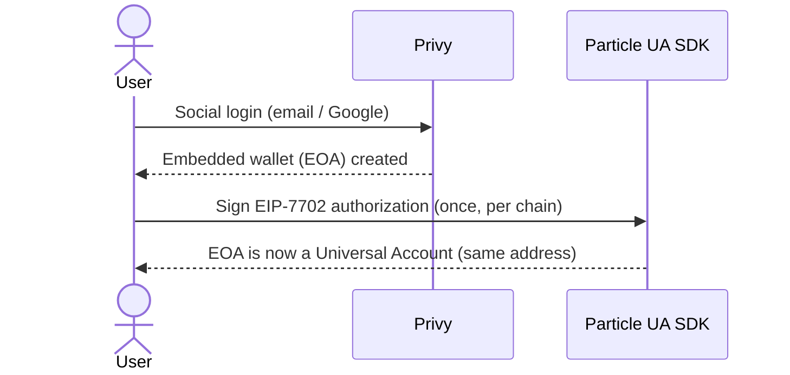
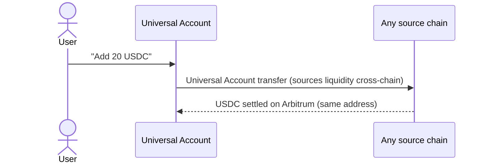
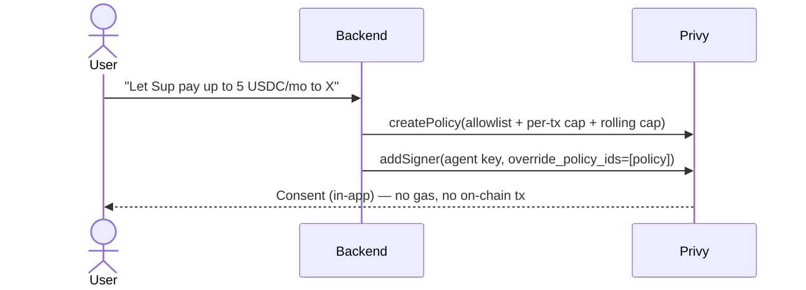
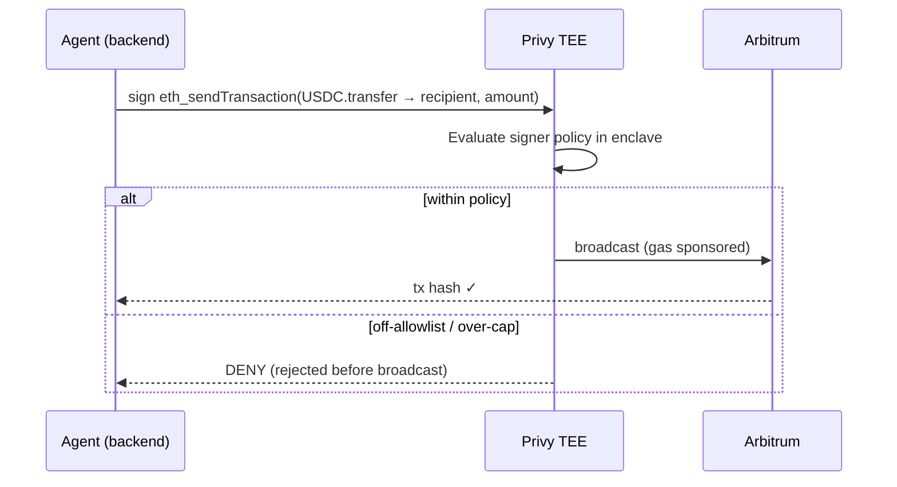
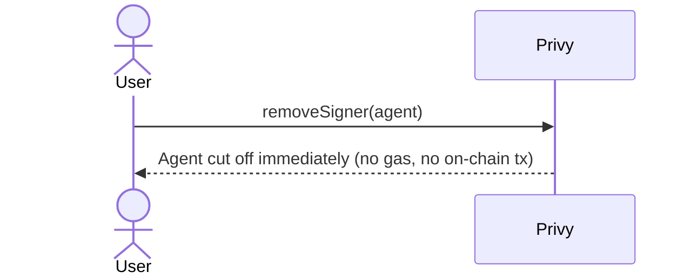
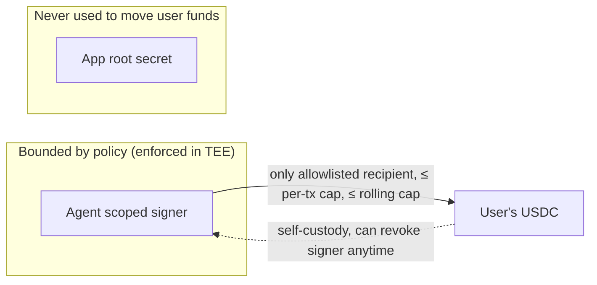

# Architecture

SupWallet is a **chain‑agnostic, self‑custodial agent wallet**. The user’s own address — upgraded to a Universal Account via EIP‑7702 — is both their wallet and the surface an AI agent is allowed to spend from, bounded by a policy enforced in a TEE.

This document covers the accounts, the flows, the trust boundaries, and the design decisions behind the v1 architecture.

---

## Accounts

| Component | Role | Custody |
|---|---|---|
| **Privy embedded wallet** | The user’s key, created on social login. Its private key lives in Privy’s secure enclave (TEE). | User |
| **Particle Universal Account** | The same EOA, upgraded **in place via EIP‑7702** — same address, unified balance across chains. | User (it *is* the user’s address) |
| **Agent scoped signer** | A backend‑controlled authorization key added as an **additional signer** on the user’s wallet, restricted by a policy. | Backend (signer only — never owns funds) |

There is **no separate agent account** and **no custom smart contract**. The agent is a policy‑scoped *signer* on the user’s own Universal Account.

---

## The two spending paths

1. **Cross‑chain (Universal Account transfer).** Bringing value in, or paying across chains, goes through Particle’s Universal Account flow, which sources liquidity across chains and settles to the destination. Signed by the user.
2. **Autonomous agent spend (plain transfer).** The agent’s day‑to‑day payments are plain `USDC.transfer` transactions on Arbitrum, signed by the agent’s scoped signer. Because an EIP‑7702 account’s delegated code only runs when the account is *called* — not when it *sends* — a plain outbound transfer executes normally, and Privy’s policy engine can inspect the raw calldata (recipient, amount) to gate it.

---

## Flows

### 0 · Onboarding (one‑time)

### 1 · Fund from any chain — the cross‑chain UA transfer

### 2 · Give Sup an allowance (add scoped signer + policy)

### 3 · Agent spends (0 user signatures)

### 4 · Revoke (instant, off‑chain)

---

## Trust boundaries

- **The agent is a signer, not an owner.** It can request signatures within its policy; it cannot change its own policy, add signers, or exceed its caps.
- **Policy is enforced at signing time in Privy’s secure enclave.** A violating transaction is never signed, so it never reaches the chain.
- **Learned the hard way (and designed for):** Privy’s *root app secret bypasses policies by design*. So the backend moves user funds **only** through the scoped, policy‑bound agent signer — never with the root secret. This separation is what makes “agent autonomy” safe.
- **Instant revocation.** Removing the signer cuts the agent off immediately; the principal never left the user’s wallet.

**Honest trade‑off:** v1 enforces the fine‑grained policy in Privy’s TEE rather than in an on‑chain contract. The absolute ceiling is the user’s own balance (self‑custody), and the fine limits are trusted to Privy’s enclave. A fully trustless on‑chain variant (see below) is kept as a future mode.

---

## Design decisions (how we got here)

1. **Funded agent “card” (rejected).** A separate ERC‑4337 account the user pre‑funds. Clean hard cap, but the user babysits balances and a new address on every chain — poor UX for the Universal Accounts vision.
2. **On‑chain `AllowanceRouter` (built, kept as reference).** The user `approve`s a custom contract; the agent spends via `transferFrom` under on‑chain allowlist/cap/rolling limits. Fully trustless (deployed + tested against real USDC). But it adds an approve step, gas for grant/revoke, and a contract to maintain.
3. **Contract‑less: Universal Account + TEE policy (shipped).** The agent is a scoped signer on the user’s own 7702 Universal Account; policy is enforced in Privy’s TEE. No approve, no `transferFrom`, no separate account, no contract — grant and revoke are gasless in‑app actions. This matches the Universal Accounts + 7702 model (“no new address, no contract deployment”) and optimizes for UX.

The result: **the account abstraction is the account**, and the agent is a bounded signer on it.

---

## Standards & building blocks

- **EIP‑7702** — upgrade an EOA in place; same address gains smart‑account behavior.
- **Particle Universal Accounts** — one address, one balance, cross‑chain execution & liquidity.
- **Privy** — embedded wallets, authorization‑key signers, TEE policy engine, gas sponsorship.
- **Arbitrum One** — settlement chain; **USDC** — unit of account.
