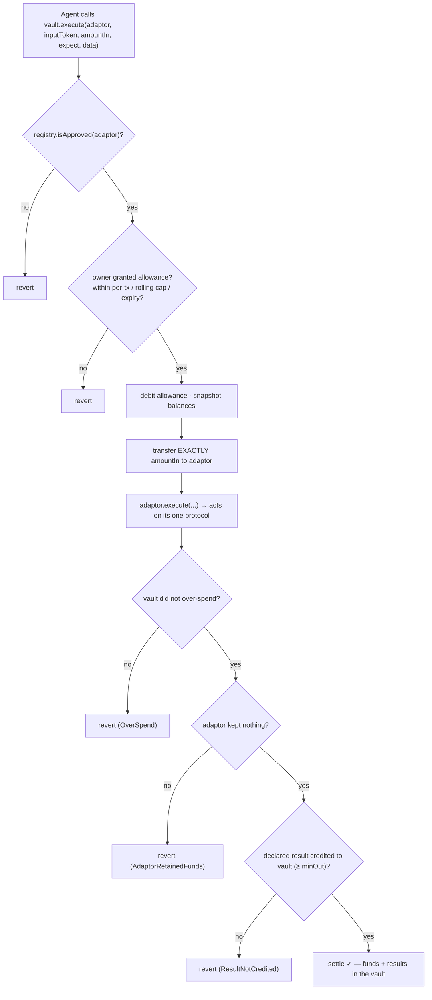
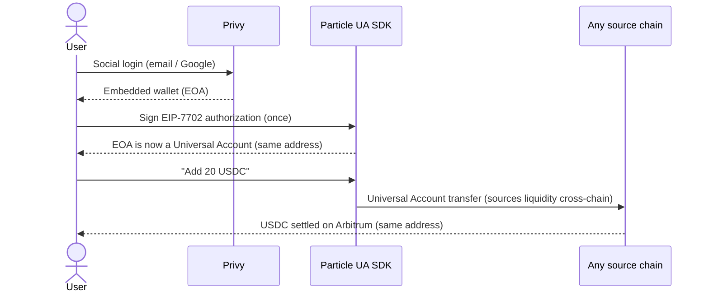
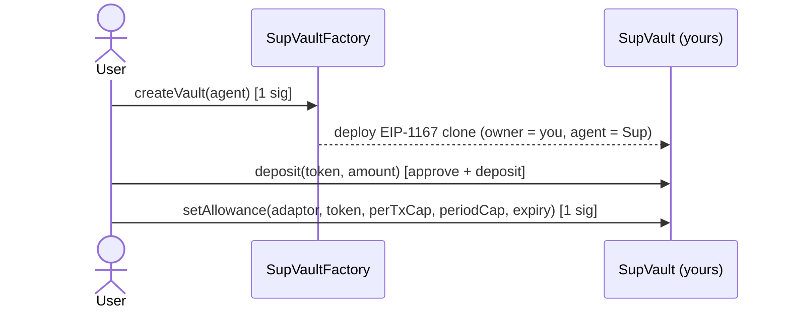
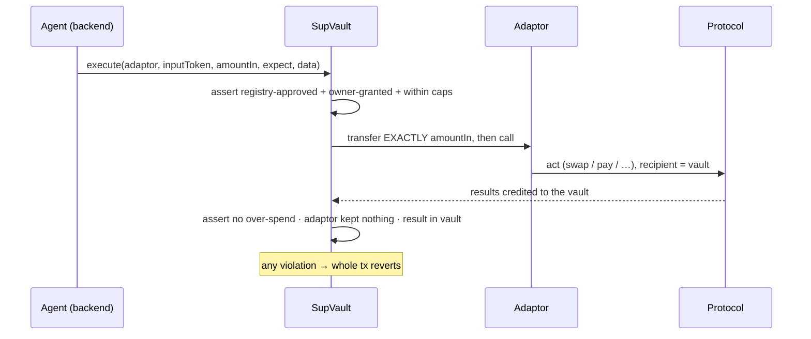
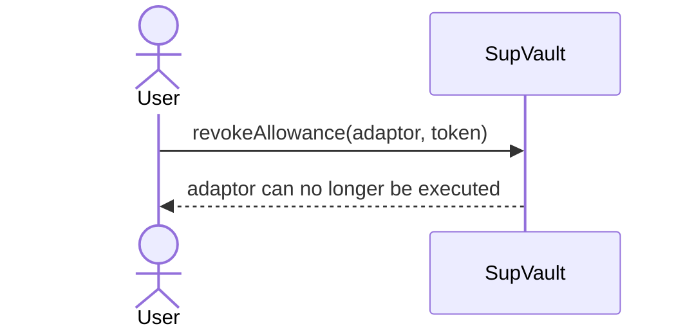
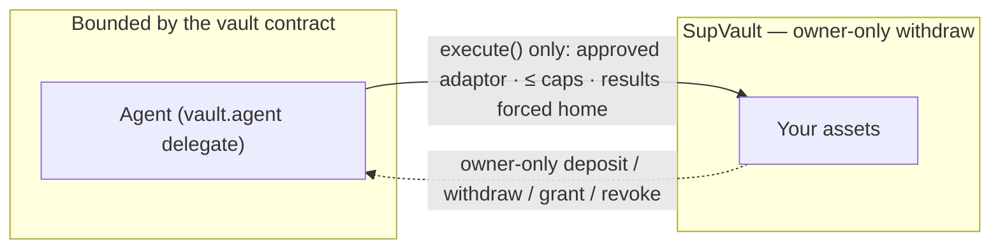

# Architecture

SupWallet is a **chain‑agnostic, self‑custodial agent wallet**. The user funds one address — their EOA upgraded to a Particle **Universal Account** via **EIP‑7702** — and their strategy assets live in an on‑chain **SupVault** that an AI agent can *operate* through allowlisted adaptors but can never *drain*. The safety is enforced by the vault contract, not trusted to a backend.

This document covers the accounts, the flows, the trust boundaries, and the design decisions behind the architecture.

---

## Accounts & contracts

| Component | Role | Custody |
|---|---|---|
| **Privy embedded wallet** | The user’s key, created on social login. Private key lives in Privy’s secure enclave (TEE). | User |
| **Particle Universal Account** | The same EOA, upgraded **in place via EIP‑7702** — same address, unified balance across chains. The funding ramp. | User (it *is* the user’s address) |
| **SupVault** | A per‑owner minimal‑proxy (EIP‑1167) clone that custodies the user’s strategy assets. Owner‑only deposit/withdraw. | User (owner‑only withdraw) |
| **Adaptors** | Small, audited, stateless contracts that wrap one protocol behind a typed, capped interface (Uniswap swap, pay, …). | Hold nothing across calls |
| **AdaptorRegistry** | The curated allowlist. A vault refuses to `execute` any adaptor not approved here — a kill switch for a bad adaptor. | Curator |
| **AdaptorListingRegistry** | The open, permissionless marketplace board. Anyone can list an adaptor for discovery; listing grants no execution rights. | Permissionless |
| **Agent “Sup” signer** | A backend‑controlled key set as the vault’s on‑chain `agent` delegate. It can only call `vault.execute(...)`, bounded on‑chain. | Backend (bounded — never owns funds) |

---

## The two spending paths

1. **Cross‑chain (Universal Account transfer).** Bringing value in, or paying across chains, goes through Particle’s Universal Account flow, which sources liquidity across chains and settles to the destination. Signed by the user. This is how the vault gets funded from any chain.
2. **Autonomous agent action (`vault.execute`).** The agent’s day‑to‑day work — swaps, payments, strategy steps — is a call to `vault.execute(adaptor, inputToken, amountIn, expect, callData)` on Arbitrum, signed by the agent’s key and gated entirely by the vault’s on‑chain checks.

---

## The vault `execute` flow — where safety is enforced

The post‑conditions (`OverSpend`, `AdaptorRetainedFunds`, `ResultNotCredited`) are the heart of the model: after the adaptor runs, the vault re‑checks the world and reverts the whole transaction unless the adaptor kept nothing and the result landed home. This is the EVM analog of a Move “hot‑potato” — results are *forced* back to the vault, in‑transaction. `call`, never `delegatecall`; a pure outflow (e.g. a payment) declares “no result asset” so the check adapts.

---

## Flows

### 0 · Onboarding & funding

### 1 · Create a vault + authorize an adaptor (owner‑signed)

### 2 · Agent acts — 0 user signatures, bounded on‑chain

### 3 · Revoke (instant, on‑chain)

---

## Trust boundaries

- **The agent is a delegate, not an owner.** It can only call `execute`; it cannot withdraw, change allowances, or approve new adaptors.
- **Two registries, on purpose.** Publishing is permissionless (discovery); *executing* requires the curated registry’s approval **and** the owner’s grant. Open to list, gated to run.
- **Blast radius = one authorized amount.** A compromised backend or malicious adaptor can lose at most one owner‑authorized `amountIn` through one owner‑approved, registry‑curated adaptor — never the rest of the vault.
- **Enforced, not trusted.** Every guarantee above is a `require`/`assert` in the vault, checked in the same atomic transaction — not a backend promise.

---

## Design decisions (how we got here)

1. **Funded agent “card” (rejected).** A separate pre‑funded account — clean cap, but the user babysits balances and a new address on every chain. Poor fit for the Universal Accounts vision.
2. **Scoped signer + TEE policy (explored).** The agent as a policy‑bound signer on the user’s own 7702 account, enforced in Privy’s enclave — gasless grant/revoke and great UX, but the fine limits are trusted to the enclave rather than to the chain.
3. **On‑chain vault + allowlisted adaptors (shipped).** Assets sit in the user’s own SupVault; the agent acts only through curated, owner‑granted adaptors; the vault’s runtime post‑conditions force results home atomically. Trust‑minimized *and* autonomous — the contract keeps the agent bounded, so the backend never has to be trusted with custody.

---

## Standards & building blocks

- **EIP‑7702** — upgrade an EOA in place; same address gains smart‑account behavior (the funding ramp).
- **EIP‑1167** — minimal‑proxy clones, so each user gets their own vault for ~50k gas.
- **Particle Universal Accounts** — one address, one balance, cross‑chain execution & liquidity.
- **Privy** — embedded wallets, authorization‑key signers, gas sponsorship.
- **Arbitrum One** — settlement chain; **Foundry / Solidity 0.8.28** — the vault, adaptors, and registries.

---

## Optional layers (feature‑flagged, off by default)

- **Walrus manifests.** Adaptor manifests can be pinned to **Walrus** decentralized storage; the on‑chain listing then points at a permanent, content‑addressed blob instead of any single server. Integrity is anchored by an on‑chain sha256 of the manifest.
- **Walrus Memory (MemWal).** Optional encrypted, user‑owned agent memory — redaction‑first (only preferences/behaviour, never secrets or exact amounts), three independent gates, and byte‑for‑byte no‑op when disabled.

Both are provider‑abstracted and default‑off, so the core wallet behaves identically with them turned off.
